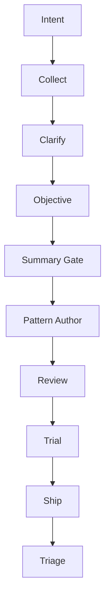

# Method Factory

**A prompt+code system for producing tested, portable agent packages — with deterministic enforcement and lighter, conversation-first prompts.**

Method Factory is the successor to [Process Engine](https://github.com/RedEyeNinja-BKK/Process-Engine). Process Engine proved the pipeline works through prompt-only experimentation and a successful end-to-end case study. Method Factory takes that proven design and adds a code layer: the state machine, gate enforcement, manifest integrity, and persistence are deterministic. The prompts are lighter, focused on conversation and content generation — not on enforcing their own rules.

> **Process Engine** remains the Turnstone-native, prompts-only reference implementation — active, not abandoned. It is the philosophical anchor. This repo builds outward from it.

---

## What it does

Tell it what you want to build, share any material you have, and it produces a complete agent package — persona, skills, templates, and evaluation cases — through a gated pipeline:



The spine is human-gated at every stage: the operator is the only authority for summary confirmation and shipping. Code owns deterministic state, gates, and persistence; prompts own conversation, clarification, and content generation. The model proposes; code validates, authorizes, persists, and verifies.

The pipeline was discovered through prompt-only experimentation (Process Engine v1.0–v1.6.0) and validated in a real end-to-end case study. Method Factory hardens the gatekeeping logic into code while keeping the prompts conversation-first.

---

## What is RC1 (`v2.0.0-rc.1`)?

RC1 is the first release candidate of the SQLite persistence reset. It is a **pre-release** for product trials, not final `2.0.0`.

**Implemented and verified:**

- **SQLite canonical transactional store** — append-only event/history model with deterministic replay validation.
- **Immutable content-addressed artifact storage** — blobs verified by SHA-256, never overwritten.
- **v0.1.2 JSONL migration** — `mf migrate-store` migrates a public v0.1.2 store to SQLite with a durable receipt and no-clobber atomic publication.
- **Deterministic event exports** — `mf export` with two formats:
  - `method-factory-events-v1` (supported current export);
  - `legacy-v012-jsonl` (v0.1.2-shaped evidence export that revalidates under the frozen legacy reader).
- **Minimal supported CLI** — intentionally only:
  - `mf migrate-store`;
  - `mf export`.
- **Python 3.11 and 3.12** supported and CI-tested.
- **JSON Action Envelope** remains the state-changing protocol; prose is never a state transition.

**Intentionally NOT in RC1:**

- generic import;
- backup/restore;
- garbage collection;
- lifecycle commands (`create`, `apply`, `status`, `summary`, `review`, `trial`, `ship`, `triage` are not exposed);
- final `2.0.0` release.

**Important non-claim:** the event hash chain is *internal consistency evidence*, not cryptographic authenticity. An attacker who replaces and rehashes the whole database would not be detected by the chain alone.

---

## Validation

Method Factory reached RC1 through a sequence of bounded, operator-gated phases (foundation → corrections → invariant closure → migration/export → evidence closure → integration → release) and **seven mandatory code-review passes** over the migration/export surface (bug / security / performance / quality → verify → dedupe → sanity), finishing with **0 critical / 0 major** findings.

- **420 tests** green on Python 3.11 and 3.12.
- Fault-injection matrix over atomic publication; deterministic-export goldens; clean wheel build; isolated-install provenance; packaged migration/export smoke — all proven in CI on the exact released commit.
- Release identity: `v2.0.0-rc.1` (tagged `c30332ba…`); package version `2.0.0rc1`.

---

## Getting started

```bash
pip install methodfactory-2.0.0rc1-py3-none-any.whl   # or: pip install -e ".[test]"
mf --version                                          # methodfactory 2.0.0rc1
```

**Migrate an old v0.1.2 store:**

```bash
mf migrate-store --source <legacy-root> [--dest <sqlite-path>]
```

The destination defaults to `<source>/methodfactory.sqlite3`; migration refuses to overwrite an existing destination and never mutates the legacy source.

**Export evidence:**

```bash
mf export --store <root> --output events.jsonl --format method-factory-events-v1
mf export --store <root> --output legacy.jsonl --format legacy-v012-jsonl
```

Both exports are deterministic and read-only.

---

## How it differs from Process Engine

| | Process Engine | Method Factory |
|---|---|---|
| **Enforcement** | Prompts + Turnstone governance | Deterministic code |
| **Platform** | Turnstone-native | Platform-agnostic |
| **Prompts** | Include enforcement rules | Conversation + content only |
| **State machine** | Prompts describe it | Code enforces it |
| **Manifest** | LLM reads/writes TOML | Validated schema + code I/O |
| **Persistence** | JSONL experiments | SQLite canonical store |
| **Trials** | Prompt-described | Code-driven harness |
| **Status** | Active reference | RC1 release candidate |

---

## Architecture

```
Code owns:  state machine, gate enforcement, manifest I/O, persistence, exports
Prompts own: conversation, clarifying questions, content generation, tone
```

Design principle: the model should not be responsible for enforcing its own constraints. Code enforces the rules; prompts guide the work.

For developers: [Architecture reset status](docs/architecture-reset-status.md) (current state + full gate history), [Public surface & error contract](docs/public-surface.md), [ADR-0012 persistence architecture](docs/adr/ADR-0012-persistence-architecture.md).

---

## Origin

Method Factory is built from the domain knowledge captured in [Process Engine](https://github.com/RedEyeNinja-BKK/Process-Engine) — specifically the pipeline design (Intent → Collect → Clarify → Objective → Summary Gate → Pattern → Review → Trial → Ship → Triage) that emerged from hundreds of prompt-only experiments and was validated in a [real end-to-end run](https://github.com/RedEyeNinja-BKK/Process-Engine/blob/main/evals/case-study-first-run.md).

The prompt-only phase was not a shortcut — it was the discovery method. We didn't guess the architecture. We ran real interactions until the lifecycle proved itself. Now the guarantees are hardened into code.

---

## License

MIT — see [LICENSE](LICENSE).

---

## Docs

- [Architecture reset status — current state + gate history](docs/architecture-reset-status.md)
- [Public surface and stable error contract](docs/public-surface.md)
- [ADR-0012 — persistence architecture](docs/adr/ADR-0012-persistence-architecture.md)
- [Action Envelope — prompt/code protocol](docs/action-envelope.md)
- [Manifest contract v0.1](docs/manifest-contract-v0.1.md)
- [Migration from Process Engine (historical)](docs/migration-from-process-engine.md)
