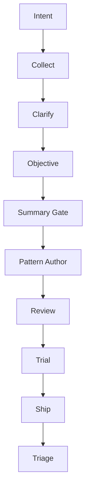

# Method Factory

**Turn what you know, what you have, and what "good" looks like into a tested, portable agent package — through a pipeline with a human at every consequential gate.**

Method Factory is a prompt+code system for building agent packages: personas, skills, templates, and the evidence trail that connects them. You describe the outcome, share your source material, answer a few clarifying questions, and agree on an objective. Then — and only then — Method Factory generates, reviews, and trials the package, with your sign-off required at the points that matter.

It is the more rigorous successor to [Process Engine](https://github.com/RedEyeNinja-BKK/Process-Engine): the same conversational, human-gated pipeline, with deterministic code owning the state, the gates, and the evidence instead of leaving them to the model's good intentions.

> **Process Engine** remains the Turnstone-native, prompts-only reference implementation — active, not abandoned. Method Factory is the prompt+code evolution of the same idea. (More on the relationship below.)

---

## What it does

Tell it what you want to build, share what you already have, and Method Factory walks a proven pipeline with you — not around you:



In human terms, the journey looks like this:

1. **You say what you want.** "I need an agent package that helps a small team manage its Etsy store."
2. **Method Factory collects what you already have.** Links, docs, past runs, examples — nothing is rejected by type.
3. **It clarifies ambiguity instead of guessing.** One question at a time, until the intent is concrete.
4. **You define what good looks like.** The objective and the outcomes you will accept.
5. **It summarizes the working basis and waits for your confirmation.** Nothing is authored before this gate.
6. **Only then does authoring begin.** The package is drafted against the agreed basis.
7. **Output goes through review and trial before shipping.** Evidence is checked, not assumed.
8. **Real feedback returns through triage.** What shipped informs what ships next.

The operator is the only authority at the consequential gates. The model proposes; code validates, authorizes, persists, and verifies.

---

## Why Method Factory?

Prompt-only systems are a great way to *discover* a workflow — run enough real conversations and you learn what actually works. But asking one LLM to both do the work and enforce its own rules makes the guarantees fuzzy. If the only thing stopping an invalid transition is a paragraph of instructions inside the same prompt that is doing the work, "guaranteed" is doing a lot of work.

Method Factory separates those jobs:

- **the model talks, clarifies, reasons, and creates** — conversation and content generation;
- **code remembers state, checks gates, persists evidence, and rejects invalid transitions** — the deterministic mechanics;
- **the human remains the authority at consequential gates** — confirmation, review, and ship.

That separation is the whole point. (The technical name for the proposal mechanism is the *JSON Action Envelope* — you do not need to know it to use the product.)

---

## What makes it different

- **Intent before generation.** It does not immediately start writing. It collects, clarifies, and asks what "good" looks like before producing anything.
- **Human gates.** Consequential transitions require explicit authority. The pipeline cannot talk itself into shipping.
- **Code enforces, models create.** Deterministic mechanics are not delegated to prose. The model's job is to be creative and precise — not to police itself.
- **Evidence survives the conversation.** State and history live in a real transactional store, so the trail outlives the chat session.
- **Portable by design.** Core mechanics are not tied to one agent harness. The same logical pipeline can run on different clients.
- **Migration without rewriting history.** Existing public stores can be migrated while preserving evidence and source integrity.

---

## Who this is for

**Good fit:**

- You build reusable agent personas, skills, and packages and want them to be more than a pile of prompts.
- You care about repeatability, evidence, and knowing *why* a package exists in its current state.
- You want human approval gates in the workflow, not model self-discipline.
- You want enforcement to live outside the LLM prompt — in code the model cannot talk its way around.
- You need portability across agent environments.
- You are comfortable with an engineering-oriented release candidate rather than a polished end-user product.

**Not a fit right now:**

- You want a one-click UI or a mature end-user application.
- You need a complete lifecycle command set today (see *What RC1 provides* below — the public CLI is intentionally minimal).
- You need the final stable `2.0.0` rather than a release candidate.

None of these are bad wants. They are just not what this RC is.

---

## What using Method Factory feels like

Say you need: **"an agent package for managing a small Etsy store — listing SEO, policy review, and weekly shop targets."**

With Method Factory, the interaction would go something like:

1. **You state the intent.** "I want an Etsy store-manager package."
2. **It asks for material.** "What do you already have? Past listings, shop data, pricing rules, review checklists?"
3. **It clarifies.** "You said 'policy review' — does that mean a pre-publication compliance check, or an audit of existing listings?"
4. **It confirms the objective.** "Here is what I understand good looks like. Working from: 3 links + 2 text blocks + 1 example run. Is this the right basis?"
5. **Only after you confirm** does it draft the persona, skills, templates, and evaluation cases.
6. **Review and trial** happen against the evidence you approved — and nothing ships without your sign-off.

That is the shape of the product: a patient, explicit partner that would rather ask than guess, and that treats your approval as a real gate rather than a formality.

> Note: in RC1 the deterministic foundation, persistence, migration, and export surfaces are real and tested; the full end-to-end authoring conversation is not yet exposed through a polished public lifecycle command. See the next section for exactly what is usable today.

---

## What RC1 provides today

There are two different things, and it is worth keeping them straight:

- **Method Factory as the product architecture** — the deterministic pipeline, state machine, gates, persistence, and evidence model described above.
- **What the `v2.0.0-rc.1` packaged public surface exposes today** — a deliberately small, verified foundation:

The public CLI has exactly two commands:

```bash
mf migrate-store   # migrate a public v0.1.2 JSONL store to the SQLite store
mf export          # export events deterministically
```

What RC1 actually provides:

- a **SQLite canonical store** with an append-only event model and deterministic replay validation;
- **immutable content-addressed artifact storage**;
- **migration** from public v0.1.2 JSONL stores, with a durable receipt and no-overwrite publication;
- **two deterministic exports**: `method-factory-events-v1` (current evidence) and `legacy-v012-jsonl` (v0.1.2-shaped evidence that revalidates against the frozen legacy reader);
- Python 3.11 and 3.12 support.

What RC1 does **not** provide:

- generic import;
- backup/restore;
- garbage collection;
- lifecycle commands (`create`, `apply`, `status`, `summary`, `review`, `trial`, `ship`, `triage` are not exposed);
- the final `2.0.0` release.

So the honest answer to "how can I use Method Factory today?" is: **as a deterministic persistence and migration/export foundation, and as the architecture the full pipeline will run on.** If you are looking for a one-command end-to-end authoring experience, that is not RC1 — and we are not pretending otherwise.

---

## Getting started

```bash
pip install methodfactory-2.0.0rc1-py3-none-any.whl   # or: pip install -e ".[test]"
mf --version                                          # methodfactory 2.0.0rc1
```

**Migrate an old v0.1.2 store:**

```bash
mf migrate-store --source <legacy-root> [--dest <sqlite-path>]
```

The destination defaults to `<source>/methodfactory.sqlite3`; migration refuses to overwrite an existing destination and never mutates the legacy source.

**Export evidence:**

```bash
mf export --store <root> --output events.jsonl --format method-factory-events-v1
mf export --store <root> --output legacy.jsonl --format legacy-v012-jsonl
```

Both exports are deterministic and read-only.

---

## How it differs from Process Engine

| | Process Engine | Method Factory |
|---|---|---|
| **Enforcement** | Prompts + Turnstone governance | Deterministic code |
| **Platform** | Turnstone-native | Platform-agnostic |
| **Prompts** | Include enforcement rules | Conversation + content only |
| **State machine** | Prompts describe it | Code enforces it |
| **Manifest** | LLM reads/writes TOML | Validated schema + code I/O |
| **Persistence** | JSONL experiments | SQLite canonical store |
| **Trials** | Prompt-described | Code-driven harness |
| **Status** | Active reference | RC1 release candidate |

Process Engine discovered and proved the conversational pipeline through hundreds of prompt-only experiments and a real end-to-end case study. Method Factory takes that lineage and moves the deterministic state, gates, and evidence into code. This feels like lineage, not dependency: Method Factory stands on Process Engine's shoulders, then changes the enforcement model.

---

## Architecture

```
Code owns:  state machine, gate enforcement, manifest I/O, persistence, exports
Prompts own: conversation, clarifying questions, content generation, tone
```

Design principle: the model should not be responsible for enforcing its own constraints. Code enforces the rules; prompts guide the work.

For engineering detail, see:

- [Architecture reset status](docs/architecture-reset-status.md) — current state + full gate history;
- [Public surface & error contract](docs/public-surface.md) — the authoritative API boundary;
- [ADR-0012 — persistence architecture](docs/adr/ADR-0012-persistence-architecture.md) — the SQLite canonical store decision;
- [Action Envelope](docs/action-envelope.md) and [Manifest contract v0.1](docs/manifest-contract-v0.1.md) — protocol and schema.

One honest non-claim, so it is never a surprise later: the event hash chain provides *internal consistency evidence*, not cryptographic authenticity. An attacker who replaces and rehashes the whole database would not be detected by the chain alone.

---

## Validation

This RC was not accepted because the happy path worked once.

- **420 tests** green on Python 3.11 and 3.12.
- **Fault injection** across atomic publication — crash states fail closed, no partial success reported.
- **Migration and export verification** — canonical v0.1.2 fixtures migrate and revalidate; exports are byte-deterministic.
- **Isolated wheel install** — the packaged artifact installs and runs from site-packages, not the checkout.
- **Exact-commit CI** — the release-gate checks out and tests the precise commit identity, not a synthetic merge.

The full development gate history lives in [architecture-reset-status.md](docs/architecture-reset-status.md); this README just tells you the outcome.

---

## Origin

Method Factory is built from the domain knowledge captured in [Process Engine](https://github.com/RedEyeNinja-BKK/Process-Engine) — the pipeline design (Intent → Collect → Clarify → Objective → Summary Gate → Pattern → Review → Trial → Ship → Triage) that emerged from hundreds of prompt-only experiments and was validated in a [real end-to-end run](https://github.com/RedEyeNinja-BKK/Process-Engine/blob/main/evals/case-study-first-run.md).

The prompt-only phase was not a shortcut — it was the discovery method. We did not guess the architecture. We ran real interactions until the lifecycle proved itself. Now the guarantees are hardened into code.

---

## Docs

- [Architecture reset status — current state + gate history](docs/architecture-reset-status.md)
- [Public surface and stable error contract](docs/public-surface.md)
- [ADR-0012 — persistence architecture](docs/adr/ADR-0012-persistence-architecture.md)
- [Action Envelope — prompt/code protocol](docs/action-envelope.md)
- [Manifest contract v0.1](docs/manifest-contract-v0.1.md)
- [Migration from Process Engine (historical)](docs/migration-from-process-engine.md)

---

## License

MIT — see [LICENSE](LICENSE).
